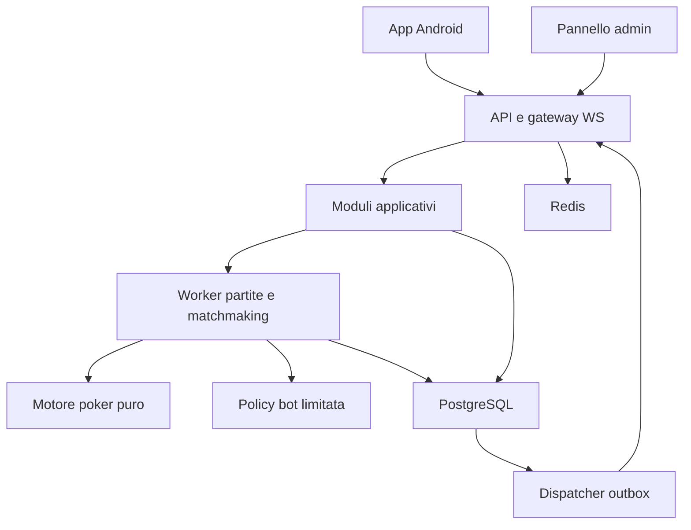
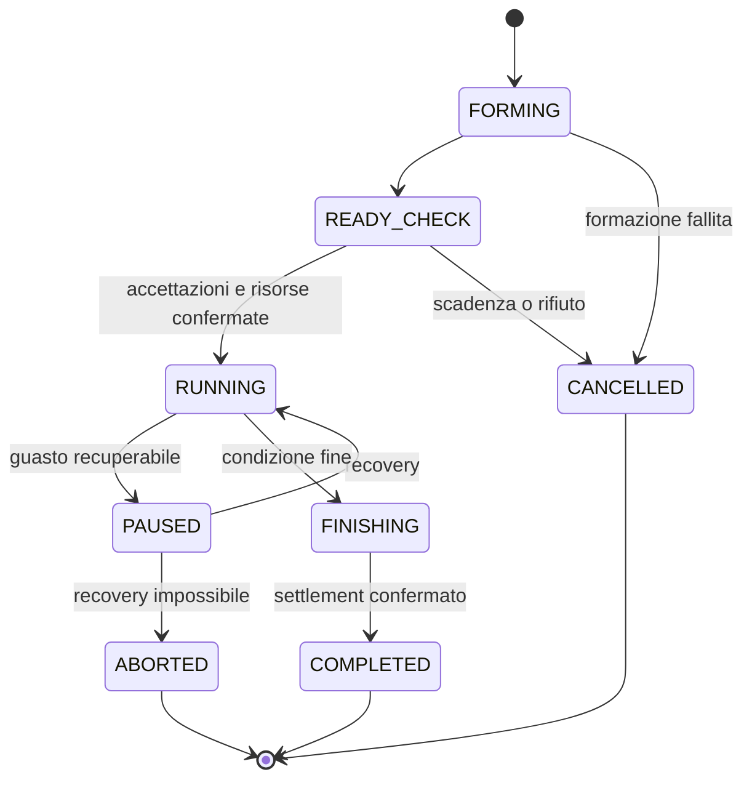

# Architettura Poker Android — specifica per agente di coding

Versione: 1.0 • Data: 25 settembre 2026 • Lingua del prodotto iniziale: italiano, con inglese predisposto.

Stato: specifica di implementazione; non è codice già sviluppato, una certificazione o una garanzia di approvazione sullo store.

## 0. Come usare questo documento

Questo documento è la fonte iniziale per sviluppare un gioco di poker multiplayer Android professionale. Include prodotto, architettura, regole di dominio, protocolli, dati, operatività e backlog. L'agente deve sviluppare incrementi funzionanti e verificabili, non limitarsi a una demo grafica o a mock di matchmaking.

Terminologia normativa:

- **DEVE / NON DEVE:** vincolo dell'implementazione di questa specifica.
- **Default proposto:** scelta concreta da utilizzare per procedere, modificabile con decisione documentata.
- **Da confermare:** decisione di prodotto o requisito esterno ancora non fornito dal committente; non inventarne la conferma.
- **V1:** prima versione pubblicabile; **V1.1/V2:** estensioni pianificate.

L'agente deve leggere tutto il documento prima di modificare un repository. In un repository esistente deve prima rispettarne le istruzioni e identificare codice, stack e convenzioni già presenti. Le tecnologie proposte qui sono il default per un progetto nuovo, non un'autorizzazione a riscrivere un progetto esistente senza motivo.

### 0.1 Ordine di implementazione

1. Decisioni e contratti: §§ 1–5, 11–12.
2. Motore deterministico e test: §§ 6–7, 20.
3. Persistenza, portafoglio, recovery: §§ 8, 10, 12–13.
4. Multiplayer reale e client: §§ 9, 11, 15.
5. Bot, classifiche, profilo e chat: §§ 9, 14, 16.
6. Operatività, sicurezza e pubblicazione: §§ 17–23.

## 1. Decisioni di prodotto e confini

### 1.1 Requisiti concordati

| ID | Requisito |
| --- | --- |
| PROD-01 | App Android professionale destinata a Google Play |
| PROD-02 | Matchmaking online e partite multiplayer |
| PROD-03 | Profilo utente, statistiche e classifiche competitive |
| PROD-04 | Chat tra gli avversari umani |
| PROD-05 | Architettura estensibile a più varianti e formati di poker |
| BOT-01 | Pool iniziale di circa 50 bot per trovare partite quando gli utenti online sono pochi |
| BOT-02 | Ricerca prioritaria di persone; bot assegnati soltanto prima dell'inizio |
| BOT-03 | Nessuna sostituzione bot → persona durante una partita |
| BOT-04 | Un bot resta nella partita fino a eliminazione o conclusione, secondo il formato |
| BOT-05 | I bot non scrivono, non rispondono e non producono indicatori di digitazione o messaggi privati |
| BOT-06 | Il committente richiede che i bot non siano identificati con un badge AI nell'interfaccia di gioco |

**Nota sul requisito BOT-06:** è una richiesta di prodotto esplicita, non una raccomandazione di trasparenza. Anche il silenzio in chat può lasciare credere di giocare contro persone. Si raccomanda di rendere riconoscibili gli avversari automatici. Questo documento conserva la richiesta senza farla passare per una decisione priva di rischi o per conformità già verificata. Non creare fotografie di persone reali, biografie, località, indicatori di presenza umana o messaggi che attestino falsamente un'identità umana. Nel backend, nella moderazione e nelle metriche la natura del bot deve sempre essere esplicita. Eventuali informative richieste nei mercati di distribuzione vanno verificate prima del rilascio.

### 1.2 Assunzioni di lavoro da non presentare come confermate

| Tema | Default proposto |
| --- | --- |
| Valore economico | Solo fiches virtuali, non convertibili, non trasferibili e senza premi di valore reale |
| Denaro reale | Escluso da schema, flussi, pagamenti e roadmap attiva |
| Mercato iniziale | Italia, infrastruttura primaria UE; espansione dopo verifica locale |
| Pubblico | Prodotto per adulti; classificazione effettiva tramite questionario store |
| Client | Flutter, esperienza 2D, smartphone Android in portrait |
| Prima variante | Texas Hold'em No Limit |
| Seconda variante | Omaha Pot Limit in V1.1, previo superamento dei test specifici |
| Ranking | Solo Sit & Go con sei persone, ingresso gratuito, nessun bot |
| Monetizzazione | Cosmetici; acquisti disabilitati nella prima beta |
| Team, budget, cloud | Non comunicati; nessuna spesa o apertura di account implicita |

Non aggiungere wallet monetari, depositi, prelievi, crypto, NFT, premi riscattabili, scambi di fiches o link a casinò. Se il committente richiede denaro reale, serve una nuova specifica: questa non è adatta a quel prodotto.

### 1.3 Scope delle release

| Release | Inclusioni | Esclusioni |
| --- | --- | --- |
| Prototipo verticale | Una mano completa dal client al server, due client, snapshot e azioni valide | Aspetto definitivo, acquisti, ranking pubblico |
| Alpha | Hold'em, sei posti, account, ledger, tavolo casual, pool bot | Produzione pubblica |
| V1 | Casual a sessione chiusa, Sit & Go casual/ranked, allenamento online, chat, profili, moderazione, pannello admin | MTT, club, messaggi privati, video/audio, trasferimenti |
| V1.1 | Omaha PLO, eventuali tavoli privati e inviti | Attivazione di nuove code senza popolazione sufficiente |
| V2 | Tornei multitavolo, altre varianti, eventi, cosmetici acquistabili | Cambiamenti economici non approvati |

Nel client non mostrare pulsanti di modalità non implementate come se fossero utilizzabili. Un feature flag server determina il catalogo delle modalità disponibili.

## 2. Definizioni e regole trasversali

| Termine | Definizione |
| --- | --- |
| Variante | Regole delle carte: Hold'em, Omaha |
| Formato | Sessione casual, Sit & Go, allenamento; successivamente MTT |
| Mano | Singola distribuzione, puntate e assegnazione dei piatti |
| Partita / match | Sessione chiusa o torneo con roster iniziale immutabile |
| Tavolo | Entità che esegue sequenze di mani; V1: un tavolo per match |
| Roster | Partecipanti assegnati prima dell'avvio |
| Seat | Posizione fisica; non riutilizzabile da un altro partecipante nello stesso match |
| Fiches PLAY | Unità virtuali persistenti del casual, interi |
| Stack torneo | Punti effimeri validi soltanto nel torneo; non sono PLAY |
| Rating | Misura competitiva distinta da fiches ed esperienza |
| Versione | Numero monotono dello stato del match |
| Proiezione | Vista dello stato autorizzata per uno specifico destinatario |

Invarianti globali:

1. Solo il server assegna carte, valida azioni, modifica saldi e certifica risultati.
2. Il roster è immutabile da `RUNNING` fino alla fine del match. Nessun riempimento successivo dei posti.
3. Un account umano ha al massimo un ticket attivo e un match attivo; vale anche per i bot.
4. Un bot appartiene al massimo a un match attivo. Cinquanta profili non equivalgono a cinquanta processi.
5. Nessun bot in una partita marcata `ranked=true`. Vincolo verificato al commit, non solo nell'interfaccia.
6. Una carta non può comparire due volte nella stessa mano.
7. Ogni azione economica deve essere atomica, idempotente e ricostruibile.
8. Nessuna modifica a regole, livello bot o politica economica a metà match.
9. Non mostrare il numero dei bot come persone connesse, iscritti o utenti attivi.
10. Il protocollo client non può determinare il tipo HUMAN/BOT o un ruolo amministrativo.

## 3. Stack e organizzazione del repository

### 3.1 Stack proposto per progetto nuovo

| Area | Scelta | Motivazione |
| --- | --- | --- |
| App | Flutter / Dart | UI mobile 2D, animazioni, codice predisposto per altre piattaforme |
| Backend | TypeScript strict, Node.js LTS supportato, NestJS | Moduli applicativi, HTTP, WebSocket e processi worker nello stesso repository |
| Realtime | WebSocket standard tramite adapter Nest `ws` | Protocollo JSON esplicito condiviso con Flutter |
| Database | PostgreSQL gestito | Transazioni, vincoli, ledger e stato durevole |
| Cache / notifiche interne | Redis | Presenza, hint di routing, rate limit; mai fonte dei saldi |
| Auth | Firebase Authentication: Google e anonimo | Identità esterna verificata sul server, collegamento ospite → account |
| Admin | React + TypeScript, applicazione web separata | Moderazione e strumenti operativi |
| Media | Object storage compatibile S3 + CDN | Asset statici e avatar curati |
| Telemetria | OpenTelemetry, metriche e crash reporting con dati minimizzati | Diagnosi indipendente dal provider |
| Ambiente locale | Docker Compose per Postgres, Redis e backend; emulatori auth | Riproducibilità |

Bloccare le versioni effettive con lockfile e immagini per digest dopo averne verificato supporto e compatibilità. Non usare tag `latest` in CI o produzione. Registrare `docs/DEPENDENCIES.md` con versioni, licenze e data di verifica. Il documento non prescrive numeri di versione che diventerebbero obsoleti.

Nest può usare sia Socket.IO sia WebSocket standard: qui la scelta è `ws`. Non collegare un client WebSocket standard a un server Socket.IO. Implementare parsing e routing del nostro envelope (§11) tramite adapter dedicato; la forma predefinita Nest non coincide automaticamente con quella qui descritta.

### 3.2 Struttura da creare

```text
apps/mobile/                 Flutter: schermate, view model, repository, transport
apps/server/                 Nest: API, WS, moduli applicativi
apps/worker/                 Runtime partite, matchmaking, outbox, scheduler
apps/admin/                  Moderazione e operatività
packages/poker-engine/       Dominio puro TypeScript, senza database o rete
packages/bot-policy/         Strategie con input limitato a informazioni lecite
packages/contracts/          OpenAPI, JSON Schema, fixture condivise
packages/server-domain/      Use case, porte e tipi applicativi
packages/test-fixtures/      Mani, mazzi, scenari e risultati attesi
infra/                       Container, deploy, osservabilità, backup
docs/                        ADR, runbook, modello minacce, decisioni prodotto
scripts/                     Bootstrap, verifiche, seed locali, generatori DTO
```

Il motore non importa Nest, ORM, Firebase o Redis. Il package bot non importa lo stato completo della mano. Il client non importa segreti, funzioni amministrative o logica autorevole dei saldi. Generare i DTO Dart da contratti o validarli con fixture bidirezionali; non presumere di condividere direttamente TypeScript con Flutter.

### 3.3 Flusso architetturale



È un monolite modulare con più ruoli di processo. Non introdurre microservizi, Kafka o Kubernetes senza una necessità misurata. Il confine tra gateway, runtime e dominio deve comunque consentire scaling indipendente.

## 4. Moduli applicativi e responsabilità

| Modulo | Possiede | Non può fare |
| --- | --- | --- |
| Identity | Associazione provider, sessioni, blocchi account | Accreditare fiches dal token client |
| Profile | Nickname, avatar, preferenze, statistiche proiettate | Accedere a carte segrete degli avversari |
| Lobby | Catalogo modalità, disponibilità e stime | Inventare persone online o attese precise non misurate |
| Matchmaking | Ticket, roster, riserva bot, creazione match | Alterare roster avviati |
| GameRuntime | Serializzazione comandi, timer, persistenza e recovery | Fare scegliere carte al client o al bot |
| PokerEngine | Transizioni valide, evaluation, piatti, risultati | Chiamare rete, clock o database |
| BotService | Policy e scheduler dei bot | Scrivere chat, ledger o conoscere mazzo futuro |
| Economy | Conti, trasferimenti, escrow, riconciliazione | Modificare risultati delle mani |
| Ranking | Rating, stagioni e graduatorie da risultati certificati | Accettare punteggi inviati dai client |
| Social | Chat, blocco, report | Modificare turni o outcome del gioco |
| Moderation | Casi, sanzioni, storico decisioni | Cambiare mazzo o pilotare una mano |
| Operations | Feature flag, configurazione, audit | Applicare configurazioni incompatibili a match attivi |

Dipendenze tramite use case e porte esplicite. Evitare chiamate circolari: pubblicare eventi di dominio dopo commit tramite outbox per statistiche, rating e analytics.

## 5. Modalità e ciclo di vita della partita

### 5.1 Catalogo iniziale

| modeId | Variante | Posti | Bot | Economia | Ranking |
| --- | --- | ---: | --- | --- | --- |
| holdem_casual_6 | NLHE | 6 | Sì, al matchmaking | PLAY con buy-in fisso | No |
| holdem_sng_casual_6 | NLHE | 6 | Sì, al matchmaking | Stack torneo gratuito | No |
| holdem_sng_ranked_6 | NLHE | 6 | Mai | Stack torneo gratuito | Sì |
| holdem_training_6 | NLHE | 6 | Cinque | Stack allenamento isolato | No |

Allenamento V1 online; offline è un'estensione, non un duplicato autorevole del motore in Dart. Il pool da 50 serve le code casual; i bot allenamento sono istanze effimere separate, con cap di capacità distinto e senza profili pubblici persistenti.

### 5.2 Sessione casual chiusa — default di prodotto

Per dare significato preciso a «la partita iniziata col bot finisce col bot», V1 usa sessioni casual a roster chiuso. Questa durata non è stata richiesta dal committente: è un default proposto modificabile prima dell'implementazione.

- Sei partecipanti all'avvio; minimo una persona. Bot solo prima dell'avvio.
- Buy-in fisso 1.000 PLAY, blinds 5/10, niente rake e niente rebuy V1.
- La sessione termina al primo confine di mano utile dopo 30 mani o 25 minuti.
- Termina anche quando restano meno di due stack attivi, oppure nessun umano vuole proseguire.
- Il limite temporale non tronca una mano già iniziata.
- Gli umani possono richiedere l'uscita: si applica dopo la mano; se devono agire e hanno abbandonato, check se lecito, altrimenti fold.
- Chi esce riceve il proprio stack residuo; il posto non viene riassegnato.
- I bot non escono per fare posto a persone. Restano fino a stack zero o fine sessione.
- Uscita amministrativa per guasto/sicurezza: match sospeso o annullato secondo §13, mai sostituzione nascosta.

Il prodotto può adottare sessioni casual senza limite futuro; va allora definita una politica di fine sessione distinta. Non implementare implicitamente tavoli aperti con ingressi a partita avviata.

### 5.3 Sit & Go

- Sei giocatori, 1.500 punti ciascuno; nessun addebito PLAY e nessun premio monetario/PLAY V1.
- Blinds proposti: 10/20, 15/30, 25/50, 50/100, 75/150, 100/200, 150/300, 200/400; successivamente raddoppio ogni livello. Livelli da cinque minuti, ante zero V1.
- Applicare nuovi blinds alla prossima mano; memorizzare il livello e il tempo accumulato di gioco.
- Un torneo continua fino a un vincitore. Disconnessione o abbandono non sostituiscono il giocatore: stack resta al tavolo, blinds e timeout continuano.
- Se eliminazioni simultanee: ordinarle per stack all'inizio della mano; a parità attribuire piazzamento condiviso e rating con pareggio.
- Nessun nuovo ingresso o rebuy dopo l'avvio. Nessun bot può entrare come sostituto di un umano disconnesso.
- Un torneo ranked non viene convertito in casual o completato con bot se manca popolazione.

### 5.4 Stati



`FINISHING` può durare durante retry di settlement. Non mostrare crediti definitivi prima del commit. La UI può mostrare «Risultato in elaborazione» e riprendere da API.

## 6. Motore poker deterministico

### 6.1 Contratto del dominio

```typescript
type Chips = bigint;
type Card = number; // 0..51, mapping documentato e stabile
type Street = 'PREFLOP' | 'FLOP' | 'TURN' | 'RIVER';
type Action =
  | { kind: 'FOLD' }
  | { kind: 'CHECK' }
  | { kind: 'CALL' }
  | { kind: 'RAISE_TO'; streetTotal: Chips };

interface VariantRules {
  id: 'NLHE' | 'PLO';
  version: number;
  holeCardCount: 2 | 4;
  evaluate(hole: readonly Card[], board: readonly Card[]): HandValue;
  legalActions(state: HandState, seatId: string): LegalActions;
}

interface Engine {
  startHand(input: StartHandInput): Transition;
  applyAction(state: HandState, seatId: string, action: Action): Transition;
  applyTimeout(state: HandState, turnId: string): Transition;
  project(state: HandState, viewer: ViewerContext): PlayerView;
}
```

I tipi sono illustrativi di interfacce da completare, non libreria compilabile allegata. `StartHandInput` contiene roster, blinds, button e un mazzo già mescolato. Il motore non legge l'orologio: riceve comandi espliciti. Policy di timeout, pause e passaggio di livello sono decise dal runtime con dati persistiti.

La transizione restituisce stato immutabile ed eventi di dominio; nessun effetto esterno. Il replay usa input persistiti e la versione del motore. La costruzione del mazzo è una responsabilità server separata.

### 6.2 Stato minimo della mano

- `handId`, `matchId`, `handNumber`, `engineVersion`, `rulesVersion`.
- `buttonSeat`, `smallBlindSeat`, `bigBlindSeat`, `street`, `board`.
- Mazzo segreto, indice delle carte consumate, hole cards e burn cards.
- Per seat: stack dietro, contribuzione street, contribuzione mano, stato folded/all-in/active, ultimo livello di puntata affrontato.
- `currentBet`, `lastFullRaiseSize`, `lastFullRaiseLevel`, insieme dei giocatori che devono ancora rispondere.
- `actorSeatId`, `turnId`, candidati alla vittoria e totale dei piatti.
- Identificatori degli input già applicati conservati dal runtime.

La distinzione tra street contribution e hand contribution è obbligatoria. I valori monetari non devono passare attraverso float o `Number` JavaScript. Sul wire sono stringhe decimali senza separatori; PostgreSQL usa BIGINT; Dart usa un tipo controllato senza perdita di precisione.

### 6.3 Sequenza Hold'em

1. Selezionare button e blinds tra i posti ancora in gioco; V1 adotta moving button sui giocatori attivi, con regole esplicite e fixture dedicate, non un misto accidentale di moving/dead button.
2. Prelevare blinds, anche parziali se stack insufficiente.
3. Distribuire due carte per giocatore, una alla volta, partendo a sinistra del button.
4. Preflop: primo attore a sinistra del big blind, saltando fold/all-in.
5. Flop: burn, tre carte; turn: burn e una; river: burn e una.
6. Postflop: primo giocatore attivo a sinistra del button.
7. Chiudere il giro solo quando tutti i giocatori non folded/non all-in hanno risposto all'ultima puntata pertinente.
8. Se resta un solo contendente, assegnare il piatto senza obbligare a mostrare le carte.
9. Se nessun'ulteriore puntata è possibile, completare le risposte pendenti e poi il board fino allo showdown.

Heads-up: il button paga small blind e agisce per primo preflop; l'altro paga big blind e agisce per primo postflop. Nel passaggio da tre a due, documentare la rotazione per evitare un doppio big blind evitabile; fixture con tutti i posti possibili del giocatore eliminato. Non cambiare tale regola durante una stagione senza versionarla.

### 6.4 Azioni e puntate

- `CALL` paga `min(stack, currentBet - ownStreetContribution)`.
- `CHECK` valido solo se non occorre aggiungere fiches.
- `RAISE_TO` esprime il totale investito nella street, non l'incremento e non il totale della mano.
- Un all-in è una puntata/raise/call che esaurisce lo stack, non un comando ambiguo separato.
- Minimo bet iniziale = big blind; minimo raise completo = livello corrente + ultimo incremento completo.
- Un raise all-in inferiore al minimo è consentito se esaurisce lo stack, ma non riapre automaticamente il diritto di rilancio agli altri.
- Per un giocatore che ha già agito, rilanci all-in cumulativi riaprono l'azione solo quando l'incremento totale affrontato raggiunge almeno il requisito di raise completo rilevante. Conservare il livello affrontato all'ultima azione e testare i casi cumulativi; non usare un solo booleano globale.
- Se un solo giocatore può ancora puntare e tutti gli altri sono all-in, non consentire puntate senza un avversario che possa coprirle; chiudere le risposte e procedere al runout.
- Blinds incompleti non devono far scendere automaticamente il livello nominale minimo del big blind preflop.
- Il server restituisce le azioni legali con `callAmount`, `minRaiseTo`, `maxRaiseTo`, eventuale `allInOnly` e `canRaise`.

### 6.5 Side pot e split pot

Calcolare i livelli distinti delle contribuzioni totali. Per ogni intervallo, moltiplicare l'ampiezza per il numero dei partecipanti che hanno contribuito almeno a quel livello. Il denaro dei folded contribuisce, ma questi non sono eleggibili a vincere. Restituire eventuale quota non chiamata prima dell'assegnazione dei piatti.

Esempio obbligatorio: A contribuisce 100, B 250, C 400, nessun altro contributo. Rimborso non chiamato a C = 150. Main pot = 300, contendenti A/B/C; side pot = 300, contendenti B/C. Se A vince il main e B il side: payout 300 ad A, 300 a B, 150 restituiti a C. Somma = 750.

Dividere ogni singolo piatto tra i vincitori a pari mano. Le fiches dispari vanno, una per volta, ai vincitori incontrati in senso orario a partire dal primo posto a sinistra del button. Nessuna preferenza per bot, paganti o nuovi iscritti.

Invariante per mano: somma stack prima = somma stack dopo; durante la mano, stack dietro + contribuzioni = totale iniziale. Niente rake V1.

### 6.6 Showdown e valutatore

- Hold'em: migliore combinazione di cinque carte tra sette, usando zero, una o due hole cards.
- Scala minima A-2-3-4-5; Asso alto nelle altre scale. Il seme non rompe parità.
- Categorie e kicker confrontati con ordinamento totale deterministico.
- V1 mostra le hole cards di tutti i contendenti non folded allo showdown; quelle folded rimangono private.
- Una vittoria uncontested non rivela automaticamente le carte del vincitore.
- Storico restituisce solo carte visibili secondo queste regole e le proprie carte.
- Valutatore ottimizzato confrontato con un oracle semplice e indipendente; eventuali librerie devono avere licenza compatibile e test propri.

### 6.7 Estensione Omaha PLO

Quattro hole cards; usare **esattamente due** carte personali e **esattamente tre** board cards. Non riutilizzare l'evaluator Hold'em senza questo vincolo.

Se `P` è il piatto totale già investito da tutti, `C` è quanto manca al call del giocatore e `B` il suo contributo street, l'incremento massimo complessivo che può aggiungere per un pot-sized raise è `P + 2*C`. Il massimo `raiseTo` è `B + min(stack, P + 2*C)`, subordinato a diritto di raise e minimo legale. Documentare i casi di blinds parziali e confrontare fixture con la convenzione scelta. Non attivare PLO finché i test pot-limit non passano.

## 7. Casualità, mazzo e isolamento delle informazioni

- Creare un mazzo di 52 carte e mescolarlo con Fisher–Yates usando interi uniformi da CSPRNG del runtime; nessun `Math.random`, seed basato sull'ora o algoritmo influenzato dall'utente.
- Persistere il mazzo completo cifrato prima di emettere le prime carte. Il recovery deve riprendere lo stesso mazzo.
- Raccogliere la casualità fuori dal motore; nei test iniettare un mazzo fisso.
- Non chiamare servizi esterni o LLM per determinare carte, puntate o vincitori.
- Nessuna modifica della distribuzione in funzione di spesa, retention, skill o perdite.
- Cifrare mazzi, carte segrete ed eventi privati con chiavi gestite fuori dal database; registrare versione chiave e prevedere rotazione.
- I worker bot ricevono una proiezione limitata. Non condividere l'oggetto `HandState` con il package bot.
- Le metriche, i log applicativi e il pannello assistenza ordinario non contengono mazzi futuri o hole cards nascoste.
- L'accesso forense a mani complete è separato, autorizzato e auditato; non disponibile per osservare una partita live a fini di gioco.

La conformità di un RNG non si dimostra solo con statistiche di distribuzione. I test di distribuzione sono diagnostici; la sicurezza deriva dalla sorgente CSPRNG e dall'implementazione corretta. Nessuna dichiarazione «certificato» senza certificazione reale.

## 8. Runtime autorevole, concorrenza e persistenza

### 8.1 Un writer per match

Ogni match ha un actor logico e un `ownerEpoch`. PostgreSQL custodisce `ownerId`, `leaseExpiresAt`, `ownerEpoch` e `stateVersion`. Redis può memorizzare l'indirizzo del worker, ma non decide chi può scrivere.

Acquisizione ownership in transazione con lock sulla riga match: se lease scaduta, incrementare epoch e assegnare owner. Rinnovo proposto ogni 5 s, lease 15 s, usando il clock del database. Ogni commit di gioco verifica owner, epoch, lease e versione attesa sotto lock. Un vecchio worker con lease perduta non può scrivere, nemmeno se crede di essere ancora owner.

Le code in memoria servono a serializzare normalmente, ma non sostituiscono il controllo nel database. Il gateway inoltra comandi al worker via canale interno autenticato; se non ottiene risposta di commit, il client conserva l'ID e ritenta. Nessun comando economico si considera acquisito solo perché pubblicato su Redis Pub/Sub.

### 8.2 Transazione di un comando

1. Autenticare sessione e identificare l'attore; il client non sceglie `userId`.
2. Lock del match e controllo ownership.
3. Cercare receipt per `(matchId, principalId, commandId)` **prima** del controllo versione; se esiste e l'hash payload coincide, restituire la risposta precedente.
4. Rifiutare riuso dello stesso ID con payload diverso: `IDEMPOTENCY_CONFLICT`.
5. Verificare `matchId`, membership, `handId`, `turnId`, versione e scadenza del turno.
6. Applicare la transizione al dominio; aggiornare lo stato autorevole.
7. Scrivere eventi, eventuali righe ledger, receipt e record outbox nella stessa transazione.
8. Commit.
9. Solo ora inviare ACK e pubblicare le proiezioni. La pubblicazione può essere ripetuta.

Stato autorevole V1: snapshot completo aggiornato a ogni comando accettato, con porzione segreta cifrata, più eventi append-only per audit. Snapshot periodici opzionali non sono l'unica copia della partita. I cambi di mano e il ledger dell'escrow devono essere atomici nella stessa transazione.

### 8.3 Outbox e subscriber

- Outbox con `eventId`, aggregate, versione, tipo, payload minimizzato, stato tentativi.
- Dispatcher almeno una volta; consumer deduplicano per eventId o chiave di dominio.
- Per aggiornamenti gioco il dispatcher può inviare «match changed»; il gateway legge lo stato committed e proietta per ciascun destinatario.
- Gli ACK non dipendono dalla riuscita della consegna WS a tutti i client.
- Le proiezioni possono saltare versioni intermedie poiché V1 invia snapshot completi. Il client applica soltanto versioni più nuove.
- Rating, statistiche e notifiche hanno chiavi di applicazione uniche; retry non incrementa due volte.

### 8.4 Timer

`turnId` e deadline UTC sono persistiti. Timer locali accelerano, uno scheduler scandisce le deadline scadute per garantire recupero. Il comando timeout ha ID deterministico `timeout:{matchId}:{turnId}` e attraversa lo stesso percorso transazionale.

Default: 15 s per azione; time bank iniziale 30 s a match, consumato automaticamente in secondi interi e persistito, senza ricarica V1. Bot sottoposti alla stessa deadline. Alla scadenza: check se possibile, altrimenti fold. Un all-in non riceve timer d'azione.

Un'azione umana è puntuale se il worker la valida sotto lock prima della deadline secondo clock server; un timestamp del client non la rende puntuale. Timer e azione concorrenti vengono serializzati. Se c'è indisponibilità server certificata, usare la politica pause/recovery, non penalizzare arbitrariamente solo alcuni utenti.

## 9. Matchmaking e pool bot

### 9.1 Ticket

Stati: `QUEUED → RESERVED → ACCEPTED → MATCHED`; terminali alternativi `CANCELLED`, `EXPIRED`. Il ticket contiene umano, modeId, regione, rulesVersion, rating server-side, createdAt, ready deadline e configVersion.

Default configurabili:

| Parametro | Default |
| --- | ---: |
| Pool bot persistenti casual | 50 |
| Attesa prima di riempire con bot in casual | 20 s |
| Ready check umano | 10 s |
| Finestra rating ranked iniziale | ±150 |
| Espansione ranked | +100 ogni 15 s, fino a ±600 |
| Suggerimento cambio modalità ranked | Dopo 60 s, senza cambio automatico |
| Match attivi per account / bot | 1 |

Usare tempo monotono trascorso dalla creazione server del ticket; non resettarlo a ogni reconnect. Regione UE unica iniziale. Lingua non crea una coda separata. Non frammentare per wallet, livello esperienza, regione piccola e rating simultaneamente.

### 9.2 Algoritmo casual

1. Selezionare ticket compatibili più anziani, con lock e skip-locked.
2. Se disponibili sei umani, formare subito il roster senza bot.
3. Se il ticket più anziano ha almeno 20 s e ci sono 1–5 umani, riservare esattamente i bot mancanti.
4. Se bot insufficienti, mantenere la coda e mostrare un'attesa onesta; non duplicare bot, non creare profili extra in silenzio e non partire con roster non conforme.
5. Riservare atomicamente ticket, bot e, per il casual PLAY, fondi del buy-in.
6. Inviare ready check agli umani. I bot sono pronti per definizione, ma non possono avviare un match senza almeno una persona che abbia accettato.
7. Se un umano rifiuta o scade: annullare la proposta, liberare bot/fondi; rimettere gli altri in coda conservando anzianità. Non sostituire di nascosto un umano già mostrato nel ready check con un bot.
8. Se tutti accettano, finalizzare roster, config e escrow e avviare. Da questo commit nessuna sostituzione.

La gara cancel-ticket/start-match deve essere serializzata: una sola transizione vince. Se il match è già iniziato, l'utente riceve `MATCH_ALREADY_STARTED` e può richiedere uscita secondo il formato, non annullare il buy-in come se non avesse giocato.

### 9.3 Ranked

Solo sei account umani collegati a un provider durevole, non sospesi. Gli ospiti anonimi possono allenarsi e giocare casual; per ranking collegano Google. Nessun buy-in PLAY; se non si trovano sei persone, la coda rimane aperta o viene annullata dall'utente.

Il rating e le preferenze sono letti dal server. Nessuna opzione client può abilitare bot in ranked. Una verifica finale sul roster è parte della transazione di avvio e della certificazione del risultato.

### 9.4 Riserva e rilascio bot

`AVAILABLE → RESERVED → IN_MATCH → AVAILABLE`, più `DISABLED`. Unique constraint/lock impedisce due assegnazioni attive. Un TTL può liberare soltanto una riserva pre-partita, mai un bot `IN_MATCH` perché un worker non risponde. Per quest'ultimo verificare lo stato durevole del match e recuperare l'ownership.

Il seed genera 50 identità tecniche idempotenti con ID stabili e avatar illustrati curati. Nessun account Google/Firebase per i bot. Nessuna email inventata o password. `participantKind=BOT` è una proprietà protetta del dominio; non un flag modificabile dal client.

Il pubblico può ricevere una proiezione seat senza badge AI, come richiesto, ma il DTO interno deve conservare sempre la distinzione. Il profilo di un bot non simula biografie umane o risultati competitivi. Il sistema di segnalazioni accetta anche report su un seat bot e li instrada internamente come possibile problema di gioco.

### 9.5 Policy di gioco bot

Input consentito: proprie carte, board, posizione, stack pubblici, puntate pubbliche, azioni legali, storico pubblico del match e casualità privata della policy. Vietati: carte altrui non mostrate, mazzo residuo effettivo, seed del mazzo, acquisti, perdite storiche individuali o dati privati degli utenti.

Archetipi iniziali: tight-passive, tight-aggressive, loose-passive, loose-aggressive; tre livelli. Parametri fissati all'avvio, nessun cambio per favorire o punire una persona.

Implementazione: range preflop configurati; postflop stima equity con simulazioni campionando soltanto carte ignote lecite; pot odds, posizione, size e randomizzazione controllata. È una policy euristica, non un solver ottimale. Separare il generatore casuale della policy da quello del mazzo.

Eseguire calcoli CPU in worker thread o processi isolati con limite, ad esempio 100 ms di budget CPU per decisione da tarare in benchmark. Latenza di presentazione proposta 0,8–3 s, sempre inferiore alla deadline; non usarla come affermazione di umanità. Salvare decisione e tempo di esecuzione pianificato per non rigenerare azioni diverse nei retry. Se la policy fallisce: check, altrimenti fold, tramite normale comando server.

Nessun componente generativo di chat. Il permesso di invio chat richiede un principal umano autenticato; i bot non possiedono tale credenziale.

## 10. Economia virtuale e ledger

### 10.1 Separazione delle valute

- PLAY: saldo persistente casual, non convertibile e non trasferibile.
- TOURNAMENT_POINTS: stack interno di un torneo, distrutto a fine torneo, non depositato nel wallet.
- TRAINING_POINTS: stack di allenamento isolato, nessun payout PLAY.
- COSMETIC_ENTITLEMENT: eventuale diritto a usare un elemento estetico; non una valuta spendibile al tavolo.

Default iniziali proposti: 10.000 PLAY all'account nuovo, claim giornaliero di 1.000 PLAY con massimo un claim per giorno UTC, nessun bonus se saldo disponibile ≥20.000. Sono parametri di simulazione economica, non stime validate di sostenibilità. Il client deve visualizzare il reset nella propria timezone a partire dal timestamp server.

### 10.2 Conti e registrazioni

Conti distinti: wallet umano, budget bot, escrow per match/seat, fondo emissione, fondo ritiro. Ogni transazione ha righe firmate la cui somma per valuta è zero. I conti tecnici di emissione possono avere un segno contabile diverso dai wallet; i wallet e gli escrow spendibili non diventano negativi.

Le righe ledger sono immutabili. Correzioni mediante transazioni compensative con motivazione, mai UPDATE delle righe storiche. Constraint differito/trigger o funzione transazionale obbligatoria verifica la somma; vietati inserimenti diretti da altri moduli. Bilancio materializzato aggiornato nello stesso commit.

Esempio casual:

1. Riserva: wallet → conto hold del ticket, una sola volta.
2. Avvio: hold → escrow seat, 1.000 PLAY.
3. Fine mano: trasferimenti fra escrow seat secondo contributi e payout, con chiave unica mano.
4. Fine match/uscita: escrow umano → wallet; escrow bot → budget bot.
5. Annullamento pre-avvio: hold → wallet con riferimento alla riserva originale.

Il ledger dei seat rappresenta il capitale al confine fra mani. Durante la mano, le puntate vivono nello stato autorevole e la somma dei capitali resta uguale. Un checkpoint all'inizio della mano consente rollback della sola mano non risolvibile.

La verifica di fondi e il debit avvengono sotto lock dei conti in ordine deterministico per evitare overdraft e deadlock. Mai usare «leggi saldo → controlla in memoria → aggiorna dopo» senza transazione.

### 10.3 Budget bot

I bot non ricevono fiches illimitate non tracciate. Un budget tecnico finanzia ogni buy-in tramite ledger, con cap giornaliero globale configurabile. Se insufficiente, sospendere nuove assegnazioni casual PLAY; non cambiare carte, policy o payout per recuperare perdite. SNG casual e training restano isolati dal PLAY.

Misurare separatamente emissioni gratuite, vincite umane contro bot, perdite umane contro bot e saldo totale. Il cap non invalida vincite già ottenute: blocca soltanto nuovi finanziamenti. La presenza dei bot può aumentare o ridurre PLAY detenuti da umani; va simulata e monitorata.

### 10.4 Idempotenza economica

Chiavi uniche: `signup:{userId}`, `daily:{userId}:{utcDate}`, `hold:{ticketId}`, `start:{matchId}:{seatId}`, `hand:{handId}`, `cashout:{matchId}:{seatId}`, `refund:{holdId}`. Scope e payload hash persistiti. I retry devono restituire il risultato precedente, non una seconda emissione.

Gli acquisti futuri finanziano soltanto cosmetici: verifica ricevuta server-side, token di acquisto univoco, gestione rimborso/revoca ed entitlement idempotente. Niente acquisti attivi prima della specifica billing e dei test del provider.

## 11. Contratti HTTP e WebSocket

### 11.1 Convenzioni comuni

- HTTP `/v1`, TLS; WS `/ws/v1`, WSS.
- JSON UTF-8; ID opachi UUID; date ISO 8601 UTC.
- Fiches e versioni BIGINT rappresentate come stringhe decimali.
- Request ID e trace ID senza PII; paginazione cursor, limite massimo server.
- Schemi con campi obbligatori, enum chiusi, lunghezze e limiti numerici.
- Versioni maggiori di protocollo incompatibili rifiutate con messaggio aggiornamento app.
- Nessun segreto/token in query string o log.

### 11.2 API HTTP minime

| Metodo e path | Input principale | Risultato / vincolo |
| --- | --- | --- |
| POST /v1/session/bootstrap | Token Firebase in Authorization | Principal interno, stato account, profilo e consensi necessari |
| GET /v1/me | — | Profilo proprio, wallet, rating, eventuale match attivo |
| PATCH /v1/me/profile | nickname, avatarId consentito | Aggiornamento moderabile, rate limit |
| GET /v1/lobby | — | Catalogo attivo, disponibilità, configurazione pubblica |
| POST /v1/matchmaking/tickets | modeId, idempotencyKey | Ticket; tutti i parametri sensibili derivati dal server |
| GET /v1/matchmaking/tickets/{id} | — | Stato soltanto del proprio ticket |
| DELETE /v1/matchmaking/tickets/{id} | — | Cancel idempotente prima del match |
| POST /v1/matchmaking/tickets/{id}/accept | offerId | Accettazione ready check atomica |
| GET /v1/matches/{id} | — | Snapshot autorizzato, non stato completo segreto |
| POST /v1/matches/{id}/leave | commandId | Uscita al confine mano o abbandono torneo |
| GET /v1/me/history | cursor | Risultati personali paginati |
| GET /v1/hands/{id} | — | Replay storico con carte redatte per richiedente |
| GET /v1/leaderboards | modeId, seasonId, cursor | Ranking certificato, mai bot |
| GET /v1/profiles/{id} | — | Solo campi pubblici consentiti |
| POST /v1/rewards/daily/claim | idempotencyKey | Emissione atomica o già riscattata |
| POST /v1/reports | targetId/messageId/handId, reason | Segnalazione idempotente con prova server |
| PUT /v1/me/blocks/{userId} | — | Blocco social idempotente |
| DELETE /v1/me/blocks/{userId} | — | Rimozione blocco |
| POST /v1/me/deletion-requests | conferma e riautenticazione | Richiesta tracciabile di eliminazione |
| POST /v1/ws-tickets | — | Credenziale monouso WS valida 30 s |

Tutte le risorse verificano ownership/membership. Conoscere un UUID non conferisce accesso. Gli endpoint admin sono namespace separato, RBAC e MFA obbligatori.

### 11.3 Autenticazione WS

Ottenere ticket monouso via HTTP autenticato; aprire WSS e inviare `session.authenticate` come primo frame entro 5 s. Il ticket si consuma atomicamente e non viene loggato. Non autorizzare subscribe o azioni prima dell'autenticazione.

Sessione WS con durata limitata e ri-autenticazione: avviso scadenza, nuovo ticket via HTTP e `session.reauthenticate`, o riconnessione. Rifiutare sessioni revocate/sospese; una partita già iniziata prosegue con regole di timeout senza affidare la sanzione al client. Default scadenza sessione 30 min, avviso 60 s prima. Revoca amministrativa propagata ai gateway e riverificata sui comandi sensibili.

### 11.4 Envelope comandi

```json
{
  "protocolVersion": 1,
  "type": "game.action",
  "commandId": "00000000-0000-4000-8000-000000000001",
  "matchId": "00000000-0000-4000-8000-000000000002",
  "handId": "00000000-0000-4000-8000-000000000003",
  "turnId": "00000000-0000-4000-8000-000000000004",
  "expectedVersion": "42",
  "payload": { "kind": "RAISE_TO", "streetTotal": "120" }
}
```

Il principal deriva dalla sessione; nessun `actorUserId` fiduciario nel payload. Ogni tipo messaggio ha schema proprio: i comandi di chat non richiedono handId e non incrementano la versione di gioco.

Messaggi client: `session.authenticate`, `session.reauthenticate`, `match.subscribe`, `match.resync`, `game.action`, `chat.send`, `session.ping`. Uscita e matchmaking usano HTTP nella V1 per evitare doppie semantiche.

### 11.5 ACK ed errori

```json
{
  "protocolVersion": 1,
  "type": "command.result",
  "commandId": "00000000-0000-4000-8000-000000000001",
  "status": "ACCEPTED",
  "committedVersion": "43"
}
```

```json
{
  "protocolVersion": 1,
  "type": "command.result",
  "commandId": "00000000-0000-4000-8000-000000000001",
  "status": "REJECTED",
  "code": "STALE_STATE",
  "retryable": false,
  "currentVersion": "44"
}
```

Codici minimi: `UNAUTHENTICATED`, `FORBIDDEN`, `ACCOUNT_RESTRICTED`, `INVALID_PAYLOAD`, `NOT_YOUR_TURN`, `STALE_HAND`, `STALE_TURN`, `STALE_STATE`, `ILLEGAL_ACTION`, `INSUFFICIENT_FUNDS`, `IDEMPOTENCY_CONFLICT`, `RATE_LIMITED`, `MATCH_PAUSED`, `MATCH_ALREADY_STARTED`, `MATCH_FINISHED`, `SERVICE_UNAVAILABLE`.

Un errore di trasporto non prova che il comando non sia stato applicato. Ritentare con lo stesso commandId/payload. Dopo un rifiuto per stato vecchio, richiedere snapshot e lasciare all'utente la nuova decisione; non reinterpretare automaticamente una puntata su uno stato diverso.

### 11.6 Snapshot personalizzato

Campi minimi: matchId, stateVersion, serverTime, status, modeId, rulesVersion, handId, handNumber, street, board, button, blinds, seat pubblici, stacks, contribuzioni, piatti, actorSeatId, turnId, deadline, proprie hole cards, legalActions per il solo attore, time bank proprio, eventuale risultato.

Le carte nascoste altrui devono essere assenti, non semplicemente offuscate nell'interfaccia. Nessuna inclusion accidentale via spread di un oggetto dominio. Definire DTO pubblici allowlist e testare la loro serializzazione.

Default V1: snapshot completo dopo ciascuna transizione; animazioni derivate dalla differenza tra snapshot con handId/turnId/eventId. Un client che riceve versione 45 dopo 42 può applicare direttamente 45. Messaggi <= versione corrente vengono ignorati. Gli eventi cosmetici mancanti non impediscono di giocare.

### 11.7 Riconnessione e backpressure

- Heartbeat proposto 15 s, connessione considerata persa dopo 45 s senza risposta; timer di gioco indipendente.
- Retry client con backoff e jitter da 0,5 a 15 s.
- Al reconnect, autentica, risolvi match attivo, subscribe e ricevi snapshot fresco.
- Le azioni non confermate vengono risolte ritentando gli stessi ID; non riprodurre vecchi tap indiscriminatamente.
- Una sola sessione di controllo per account: nuovo login di gioco revoca il vecchio controller con `SESSION_REPLACED`. Nessuna doppia azione da due dispositivi.
- Limitare code in uscita: coalescere snapshot a quello più recente, non perdere receipt logiche. Se il client è troppo lento, disconnettere e permettere resync.
- Frame client massimo proposto 8 KiB; chat massimo 300 caratteri Unicode e limite byte separato.

## 12. Modello dati PostgreSQL

Il seguente è il modello logico normativo. L'agente deve produrre migrazioni SQL effettive, indici e constraint; un diagramma o un ORM da soli non sono sufficienti.

### 12.1 Identità e prodotto

| Tabella | Campi principali | Vincoli / indici |
| --- | --- | --- |
| principals | id, kind HUMAN/BOT, status, created_at | kind immutabile; bot senza provider |
| auth_identities | id, principal_id, provider, provider_subject | UNIQUE(provider, provider_subject) |
| profiles | principal_id, nickname, nickname_normalized, avatar_id, locale | PK principal; nickname filtrato, uniqueness normalizzata se promessa in UI |
| consent_records | id, principal_id, terms_version, privacy_version, accepted_at | Append-only; consenso marketing distinto |
| device_sessions | id, principal_id, controller_epoch, revoked_at | Indice account/stato; nessun token in chiaro |
| account_restrictions | id, principal_id, type, reason_code, expires_at | Audit della provenienza |
| bot_profiles | principal_id, policy_id, policy_version, skill, enabled | FK principal BOT validata da servizio/trigger |
| bot_assignments | id, bot_id, match_id, state, reservation_expires_at | UNIQUE parziale bot_id per RESERVED/IN_MATCH |
| mode_configs | id, mode_id, version, payload, enabled | UNIQUE(mode_id, version), immutabile una volta usata |

### 12.2 Matchmaking e gioco

| Tabella | Campi principali | Vincoli / indici |
| --- | --- | --- |
| matchmaking_tickets | id, principal_id, mode_id, status, created_at, offer_id, config_version | UNIQUE parziale principal per stati attivi; indice mode/status/created |
| active_match_memberships | principal_id, match_id | PK principal; release solo alla fine/uscita effettiva |
| matches | id, mode_id, ranked, status, config_version, owner_id, owner_epoch, lease_expires_at, state_version | Indici status/lease; roster hash |
| match_seats | match_id, seat_no, principal_id, kind_snapshot, initial_stack, status, final_place | PK match/seat; UNIQUE match/principal; immutable identity dopo start |
| game_states | match_id, state_version, public_state, secret_state_cipher, key_version, engine_version, turn_deadline | PK match; deadline indicizzata |
| hands | id, match_id, number, status, start_checkpoint, completed_at | UNIQUE match/number; secret checkpoint cifrato |
| game_events | id, match_id, hand_id, state_version, event_index, type, payload_cipher_or_public | UNIQUE match/version/event_index; append-only |
| command_receipts | match_id, principal_id, command_id, request_hash, result, created_at | PK match/principal/command; includere principal tecnici scheduler |
| outbox | id, aggregate_id, event_type, version, payload, attempts, delivered_at | Indice parziale non consegnati |
| match_results | match_id, result_version, certified, contains_bots, results, completed_at | Un risultato vigente; versionare rettifiche |

`active_match_memberships` evita il difficile constraint trasversale su più match. Nel casual un umano eliminato può uscire dalla membership attiva dopo il settlement della propria partecipazione; il suo seat storico rimane immutabile. In ranked, la membership resta riservata anche dopo l'eliminazione fino alla conclusione del torneo e all'applicazione del rating: la UI può lasciare il tavolo, ma mostra che una nuova partita sarà disponibile al termine del torneo. Questo default V1 evita tornei competitivi sovrapposti e aggiornamenti rating fuori ordine. I bot eliminati possono essere liberati dopo il settlement della loro eliminazione, senza cambiare il roster storico. Fine torneo significa fine della partecipazione ancora attiva, non obbligo di occupare il pool dopo eliminazione.

### 12.3 Economia e ranking

| Tabella | Campi principali | Vincoli / indici |
| --- | --- | --- |
| ledger_accounts | id, owner_id, match_id, seat_no, kind, currency, balance | Check valuta; nonnegative per conti spendibili |
| ledger_transactions | id, idempotency_key, payload_hash, reason, related_id, created_at | UNIQUE idempotency_key |
| ledger_entries | transaction_id, line_no, account_id, amount | PK transaction/line; somma zero differita per valuta |
| reward_claims | principal_id, reward_type, period_key, transaction_id | UNIQUE principal/type/period |
| seasons | id, starts_at, ends_at, state, rules_version | Intervalli senza sovrapposizione per modalità |
| ratings | principal_id, mode_id, season_id, rating, games_played | PK composita; solo umani |
| rating_applications | match_id, result_version, principal_id, before, delta, after | UNIQUE match/version/principal; rettifica non doppio accredito |
| player_stats | principal_id, mode_id, opponent_pool, counters, projection_version | Separare HUMAN_ONLY / MIXED / TRAINING |
| cosmetic_entitlements | principal_id, item_id, source, source_id, revoked_at | UNIQUE source/source_id/item |

Conservare rating con precisione decimale sufficiente, non arrotondare gli aggiornamenti singoli a interi; arrotondamento solo in visualizzazione. Il ledger usa interi per fiches.

### 12.4 Social e operatività

| Tabella | Campi principali | Vincoli / indici |
| --- | --- | --- |
| chat_messages | id, match_id, sender_id, client_message_id, body, state, created_at | UNIQUE sender/client_message_id; indice match/time |
| user_blocks | blocker_id, blocked_id, created_at | PK coppia; vietato self block |
| reports | id, reporter_id, target_id, message_id, hand_id, reason, status | Indice status/time; prove server-side |
| moderation_actions | id, case_id, moderator_id, action, reason, expires_at | Append-only |
| admin_audit | id, actor_id, action, target_id, before_redacted, after_redacted, trace_id | Immutabile, senza segreti |
| deletion_requests | id, principal_id, status, requested_at, completed_at | Job idempotente e verificabile |
| feature_flags | key, version, value, audience, changed_by | Audit; snapshot al match start |

FK esplicite, `NOT NULL` per campi di stato, check enum e indici sulle query reali. Evitare cascade delete indiscriminati su ledger e prove. Dati cancellabili, dati pseudonimizzati e retention legittima vanno trattati con policy per categoria.

## 13. Crash, failover e annullamenti

### 13.1 Recovery normale

1. Nuovo worker acquisisce lease con nuovo epoch.
2. Carica snapshot committed, mazzo cifrato e receipt; verifica versione e checksum.
3. Riprende stessa mano, stessi stack e stesso mazzo.
4. Ricostruisce timer e decisioni bot pianificate; deduplica input già applicati.
5. Pubblica snapshot fresco; i client convergono senza ricreare un nuovo match.

Al cambio owner durante una mano, mettere la partita in pausa tecnica e notificare recovery. Default: ripresa con almeno 10 s per il turno corrente; congelare il tempo dei livelli torneo durante pausa. Registrare `PAUSE/RESUME` e gli spostamenti delle deadline. Pause ripetute oltre soglia operativa generano incidente; il singolo client disconnesso non può attivare questo meccanismo.

### 13.2 Guasti

| Guasto | Comportamento |
| --- | --- |
| Redis non disponibile | Saldi/stato salvi; sospendere nuova coda se necessaria, fallback lettura snapshot, degradare presenza |
| Worker cade prima commit | Nessun ACK; retry comando, stesso stato |
| Worker cade dopo commit prima ACK | Receipt restituisce il commit precedente |
| Gateway cade | Reconnect a un altro gateway, snapshot autorevole |
| Database non disponibile | Sospendere azioni e nuove partite; non giocare solo in memoria |
| Outbox ritardata | Stato committed valido; client resync, monitorare backlog |
| Chiave decrittazione non disponibile | Pausa; niente mazzo nuovo per la mano in corso |
| Stato irrecuperabile | Escalation operativa e abort secondo checkpoint; niente correzioni arbitrarie |

### 13.3 Abort definitivo

- Casual: annullare soltanto la mano incompleta tornando ai capitali del suo checkpoint iniziale, preservando le mani concluse; accreditare gli escrow residui una sola volta.
- SNG/allenamento: nessun rating o premio per match abortito; punti effimeri chiusi. Non assegnare un vincitore per mancanza di infrastruttura.
- Se la mano era già committed ma il client non l'ha vista, non trattarla come incompleta.
- Se non si può provare un checkpoint coerente, bloccare settlement automatico e aprire riconciliazione auditata. Non inventare importi.
- Pubblicare stato finale chiaro e ragione generica comprensibile; mantenere dettaglio tecnico nel supporto.

## 14. Ranking, stagioni e statistiche

### 14.1 Idoneità

Un risultato modifica rating soltanto se: modalità ranked, sei umani verificati all'avvio, match `COMPLETED`, risultato certificato, nessun bot in roster, rulesVersion supportata, non annullato. La flag `contains_bots` è calcolata dal roster immutabile, non dichiarata dal client.

### 14.2 Formula V1 proposta

Rating iniziale 1.500, K=24 uguale per tutti. Per ciascuna coppia di giocatori i/j:

```text
Eij = 1 / (1 + 10^((Rj - Ri)/400))
Sij = 1 se i termina davanti a j; 0 se dietro; 0.5 se a pari piazzamento
delta_i = (24 / 5) * somma_j_diverso_i(Sij - Eij)
R_i_nuovo = R_i_pre_match + delta_i
```

Usare tutti i rating prima del match, mai aggiornarli in cascata durante il calcolo. Salvare i sei rating iniziali all'avvio. Aggiornare le sei righe rating e le sei applicazioni in un'unica transazione con lock in ordine stabile; soltanto dopo il commit rilasciare le membership ranked. Nessun altro percorso può modificare quei rating mentre il match è attivo. Con K uniforme la somma dei delta è circa zero salvo precisione numerica. Questa è una baseline pairwise Elo per il piazzamento multiplayer, non una misura validata dell'abilità nel poker. Prima del lancio pubblico simulare varianza, convergenza, collusione e impatto degli abbandoni.

Le prime 20 partite sono provvisorie; il rating viene calcolato ma non entra nella graduatoria pubblica finché non si raggiunge la soglia. Le leghe sono una proiezione del rating; soglie proposte Bronze <1400, Silver 1400–1599, Gold 1600–1799, Platinum 1800–1999, Diamond ≥2000. Nessun premio PLAY V1.

### 14.3 Stagioni

Default 28 giorni, UTC. Un match appartiene alla stagione attiva al suo avvio; il rating iniziale è riservato per quella stagione. A chiusura, impedire nuove partenze nella stagione vecchia, attendere i match già avviati e i job rating prima di finalizzare la classifica. La stagione nuova può partire con seed dal rating precedente finalizzato; per V1 evitare sovrapposizione competitiva durante la breve finalizzazione.

Reset proposto `1500 + 0.5 * (rating_precedente - 1500)`, nessun decadimento inattività V1. Spareggio di visualizzazione: rating non arrotondato, poi più piazzamenti primi, poi ID stabile; non «più fiches acquistate».

### 14.4 Rettifiche e frodi

Sospetti di collusione generano casi con evidenze: ripetizione eccessiva di tavoli, trasferimenti sistematici, soft play, identità correlate. Non bannare automaticamente sulla base di un solo IP condiviso. Un risultato rettificato ha versione nuova e richiede ricostruzione sequenziale dei rating dipendenti della stagione o procedura esplicita di compensazione validata; non sottrarre ingenuamente il vecchio delta dopo altri incontri.

Statistiche pubbliche: mani giocate, tornei, piazzamenti, vittorie e trend. Separare nel backend umano-only/mixed/training; non presentare vittorie sui bot come risultati ranked. VPIP/PFR eventuali solo dopo averne definito denominatori e privacy, non metriche ambigue aggiunte a caso.

## 15. Client Android e qualità dell'esperienza

### 15.1 Schermate

1. Avvio e controllo versione supportata.
2. Onboarding breve, termini/informativa e scelta Google/ospite.
3. Home con «Gioca», allenamento, modalità e stato wallet.
4. Coda: stato reale, annulla, ready check; nessun falso contatore umano.
5. Tavolo: carte, board, stack, puntate, timer, azioni, chat richiudibile.
6. Risultato: piazzamento, saldo finale o stato settlement, rating se idoneo.
7. Profilo e statistiche.
8. Classifica con stagione, posizione propria e indicazione provvisorio.
9. Impostazioni: audio, vibrazione, accessibilità, lingua, privacy, blocchi, eliminazione account.
10. Segnalazione e assistenza contestuale con riferimento mano/match.

Il profilo ospite va collegato senza creare un secondo wallet. In caso di account Google già associato ad altro principal, non sommare automaticamente bonus e saldi: usare un flusso di recupero/merge controllato, mantenendo l'identità esistente e impedendo double claim. V1 può richiedere all'utente di scegliere l'account esistente senza merge dei saldi, con messaggio chiaro.

### 15.2 Architettura Flutter

Feature folder: auth, lobby, matchmaking, table, results, profile, rankings, chat, settings. Ogni feature separa widget/view, view model/controller, repository e data source. Il transport WS è condiviso; lo stato visuale del tavolo è una proiezione immutabile dello snapshot server.

- Nessuna logica di saldo nei widget.
- Una macchina a stati del client gestisce CONNECTING/WAITING/PLAYING/RECONNECTING/PAUSED/FINISHED.
- Non applicare ottimisticamente nuove carte, saldo o risultato. Il tap può mostrare stato pending fino all'ACK.
- Evitare pulsanti attivi per azioni non ammesse; il server ricontrolla comunque.
- Reset delle preazioni quando cambia il loro significato. «Check» non diventa «Call» al rialzo; «Call any» escluso V1.
- Mostrare importo effettivo call e totale raiseTo senza ambiguità.
- Timer sincronizzato con tempo server, compensazione offset solo visuale; mai autorità client.
- Se arriva snapshot più recente durante un'animazione, convergere subito allo stato corretto e cancellare animazioni obsolete.

### 15.3 Design e accessibilità

Default: palette scura, tavolo verde/desaturato, accenti limitati, carte molto leggibili. Niente UI dipendente esclusivamente dal colore dei semi. Target touch almeno 48 dp; font scalabili, contrasto adeguato, supporto screen reader dove possibile, opzione animazioni ridotte e vibrazione disattivabile.

Portrait V1: sei seat disposti senza sovrapporre board, bottoni o chat. Safe area e tastiera gestite. Testare telefoni piccoli e medi, non soltanto il simulatore di fascia alta. Audio opzionale, niente dati personali nei suoni/notifiche.

Asset originali o con licenza documentata. Nessun marchio o interfaccia copiata da competitor. Nome definitivo, logo e identità visiva restano da scegliere; usare un nome provvisorio neutro nei sorgenti, non pubblicarlo come marchio definitivo.

## 16. Chat, profili e moderazione

V1: sola chat testuale del match, emoji standard; niente immagini, audio, link attivi, DM o chat globale. Invio consentito solo a umani membri del match non silenziati. Al termine il canale diventa read-only dopo un breve intervallo configurato.

- Messaggio max 300 caratteri Unicode, controlli byte, normalizzazione e rimozione caratteri di controllo pericolosi.
- Rate limit proposto 5 messaggi/10 s e 30/min, più protezione spam ripetitivo.
- Sanitizzazione in rendering; React non deve interpretare HTML del messaggio.
- Moderazione di nickname e messaggi, filtro base + segnalazione + coda umana. Un filtro automatico non è l'intero sistema.
- Blocco utenti: nasconde messaggi in entrambe le direzioni social previste; non garantisce di non incontrarsi al tavolo. Spiegarlo nella UI. Se futura esclusione matchmaking, proteggerla da abuso competitivo.
- Segnalazione con ID del messaggio e snapshot server; non fidarsi soltanto di testo ricopiato dal segnalante.
- Sanzioni: avviso, mute temporaneo, restrizione chat, sospensione account. Distinguere sanzione social da interruzione del gioco.
- Moderatori non possono inviare messaggi fingendosi un altro partecipante.
- I bot non ricevono credenziali di invio, non rispondono con un LLM e non producono notifiche chat.

Retention proposta da validare: chat ordinaria 30 giorni, prove segnalate 90 giorni dopo chiusura caso, log tecnici 30 giorni, mani 90 giorni, dati economici/audit secondo policy documentata e necessità effettiva. Non trattare questi numeri come obblighi di legge. Implementare job di cancellazione con test e gestione backup/retention coerente.

Avatar V1 da catalogo curato, senza upload fotografico: semplifica privacy e moderazione. Nickname modificabile con cooldown proposto 7 giorni. I report storici referenziano principal ID stabile e conservano il nome visualizzato al momento con retention appropriata.

## 17. Sicurezza, privacy e accessi

### 17.1 Autenticazione e autorizzazione

Il backend verifica firma, issuer, audience e scadenza dei token Firebase tramite SDK ufficiale e mapping al principal interno. Non fidarsi della sola decodifica JWT. Account sospesi/revocati controllati dal sistema interno; Firebase Auth non sostituisce l'autorizzazione applicativa.

Segreti soltanto in secret manager/config locale esclusa da git. Nessun service account nell'APK, nessuna chiave amministrativa nel frontend admin. Client può includere configurazioni pubbliche necessarie del provider, non credenziali privilegiate.

RBAC admin: SUPPORT, MODERATOR, ECONOMY_OPERATOR, ADMIN. MFA obbligatoria, sessioni brevi, audit di letture sensibili e mutazioni. L'operatore economico può creare compensazioni motivate, non modificare mani o manipolare mazzi.

### 17.2 Minacce e controlli

| Minaccia | Controllo minimo |
| --- | --- |
| Client modificato | Server valida ogni azione e importo |
| Accesso a carte altrui | DTO allowlist, autorizzazione per viewer, test di non divulgazione |
| Replay / doppio tap | Receipt persistenti e payload hash |
| Doppio writer | Lease con epoch e verifica transazionale |
| Multi-account / bonus farming | Limiti claim, segnali rischio, nessuna fiducia nel solo device ID |
| Collusione | Analisi hands e casi verificabili, ranking senza bot |
| Spam / molestie | Rate limit, mute, blocco, report e moderazione |
| SQL injection / XSS | Query parametrizzate e testo escapato |
| Credential leakage | Secret manager, scansione CI, log redatti |
| DDoS / abuso WS | Limiti connessioni, frame, frequenza e backpressure |
| Operatore interno scorretto | RBAC, audit, nessun endpoint per scegliere vincitori |

Attestazione dispositivo eventuale è un segnale aggiuntivo, non unica autorizzazione né garanzia antifrode. Non introdurre fingerprint invasivi senza necessità e valutazione privacy.

### 17.3 Dati e cancellazione

Minimizzare PII: nessun indirizzo fisico o data di nascita completa se non necessari alla policy effettiva. Informativa, termini e consensi versionati. Analytics senza testo chat, token, email o carte nascoste.

La cancellazione account deve: revocare sessioni, impedire nuovi match, gestire il match attivo secondo regole normali, scollegare identità, cancellare/pseudonimizzare profilo e dati non più necessari, avviare cancellazione presso provider applicabili e rendere verificabile lo stato. Prevedere percorso in-app e pagina web esterna. Non cancellare righe ledger arbitrariamente rompendo riconciliazione; documentare basi e tempi di conservazione con consulenza adeguata al mercato.

La presenza di fiches senza valore reale non esonera automaticamente da requisiti privacy, classificazione o regole store. Il documento non sostituisce la verifica legale del prodotto concreto.

## 18. Pannello amministrativo e configurazione

Funzioni V1:

- Lista match con stato, versione, worker, durata e occupazione umani/bot.
- Salute delle code, bot disponibili/riservati/in partita, motivi di blocco.
- Ricerca utente autorizzata, provvedimenti, casi e supporto.
- Riconciliazione ledger e compensazioni con motivazione.
- Abilitazione modalità per nuove partite, manutenzione e blocco nuove iscrizioni.
- Visualizzazione versioni config/engine e incidenti; storico azioni admin.

Non esporre: modifica carta, odds, vincitore, stack live arbitrario, rating manuale senza procedura, impersonazione chat. Niente funzione «fai vincere il nuovo utente».

Configurazioni versionate da congelare sul match: regole, blinds, timer, policy bot, buy-in, durata sessione, modalità di roster e versione ranking. Config mutabile globale può influire soltanto su nuovi match, salvo kill switch operativo.

`disable_new_bot_matches` impedisce nuove assegnazioni ma lascia concludere quelle attive. `disable_chat` può sospendere invio con messaggio chiaro. Un kill switch di sicurezza grave può mettere in pausa match, non rimuovere bot o ridistribuire carte in silenzio.

## 19. Infrastruttura, CI/CD e operatività

### 19.1 Ambienti

Local, test CI, staging e production separati: database, Redis, auth project, bucket, chiavi e analytics distinti. Nessun test di carico su produzione senza autorizzazione. Seed solo sintetici; mai esportare dati utente reali nei test.

V1: una regione UE, database gestito con backup e point-in-time recovery, Redis gestito o dedicato, API/gateway replicabili e worker con drain. Provider finale da confermare; IaC deve rendere ripetibile la configurazione senza introdurre servizi specifici inutili.

### 19.2 Deploy

1. Lint, typecheck, unit/integration/contract test.
2. Build immagini immutabili, scansione dipendenze e secret.
3. Migrazioni additive compatibili con codice precedente.
4. Staging, smoke con due client reali e failover test mirato.
5. Deploy gateway compatibili con protocollo corrente e precedente supportato.
6. Worker vecchi in drain: nessun nuovo match, completamento o trasferimento con snapshot/engine compatibile.
7. Rollout graduale, controllo errori e rollback applicativo se necessario.

Non cambiare motore di una partita a metà esecuzione. Tenere disponibile la versione dell'engine dei match attivi fino alla loro fine oppure migrare solo con schema e test espliciti. Migrazioni distruttive solo in release separata dopo rimozione dipendenze.

### 19.3 Backup e recovery

Target proposti: RPO disastro infrastrutturale ≤5 minuti, RTO ≤60 minuti; obiettivi da validare con provider e prove restore. Un crash del solo worker, con database sano, deve preservare ogni comando ACKed. Backup cifrati, accessi ristretti, restore staging provato prima del lancio e periodicamente. Non dichiarare RPO zero per perdita completa di regione se non dimostrato.

### 19.4 Configurazione minima

L'agente deve generare `.env.example` senza segreti reali, documentando almeno:

```dotenv
APP_ENV=local
DATABASE_URL=
REDIS_URL=
AUTH_PROVIDER=firebase
FIREBASE_PROJECT_ID=
AUTH_EMULATOR_HOST=
GAME_REGION=eu
BOT_POOL_SIZE=50
BOT_FILL_AFTER_SECONDS=20
ALLOW_RANKED_BOTS=false
PLAY_PURCHASES_ENABLED=false
OTEL_EXPORTER_OTLP_ENDPOINT=
SECRET_STATE_KEY_REF=
```

`ALLOW_RANKED_BOTS` deve essere rifiutato al bootstrap se true, non diventare un modo per aggirare l'invariante. L'emulatore auth è consentito solo negli ambienti non produzione. Le credenziali del provider provengono da identità workload o secret manager, non da valori di esempio inseriti nel repository.

## 20. Test e criteri di qualità

I test sono parte della consegna perché poker, saldi e concorrenza hanno errori difficili da vedere manualmente. Non sostituire la verifica con screenshot del tavolo.

### 20.1 Matrice minima

| Area | Casi obbligatori |
| --- | --- |
| Valutatore | Tutte le categorie, kicker, wheel, board giocato interamente, parità completa |
| Turni | Preflop/postflop, heads-up, passaggio 3→2, blind parziali, seat folded/all-in |
| Puntate | Check illegale, call parziale, raise minimo, all-in corto, riapertura cumulativa |
| Piatti | Uncontested, tre livelli all-in, folded contributor, rimborso non chiamato, odd chip |
| Invarianti | Unicità carte, stack non negativi, conservazione fiches, impossibilità azioni fuori turno |
| Replay | Stessi input + stesso mazzo + stessa versione → stesso stato finale |
| Proiezioni | Mai carte altrui nascoste, neppure in errori, log, history e snapshot reconnect |
| Concorrenza | Due azioni stesso turno, doppio click, timeout/action race, doppio owner |
| Ledger | Doppio claim, reserve/cancel/start race, doppio settlement, mancata disponibilità fondi |
| Bot | Nessuna carta segreta, azioni lecite, limiti CPU, una sola assegnazione, silenzio chat |
| Matchmaking | Pool esaurito, ready timeout, min un umano, priorità umani, nessun join dopo start |
| Ranked | Rifiuto bot, nessun rating casual/abort, aggiornamento idempotente, tie e reset |
| Mobile | App background, cambio rete, perdita ACK, snapshot fuori ordine, tastiera/chat |
| Moderazione | Block/mute/report, replay messaggi, testo malevolo, principal bot senza permessi chat |
| Recovery | Kill worker prima/dopo commit, gateway restart, Redis down, DB pause, chiave assente |

### 20.2 Fixture numeriche

- Side pot A100/B250/C400: 300 main, 300 side, 150 return.
- Split di 101 tra due vincitori: 51/50 secondo posizione stabilita, mai arrotondamento che perda una fiche.
- Bet 100, all-in a 150 dopo che un giocatore ha già chiamato 100: quel singolo corto non gli riapre il raise da solo.
- Bet 100, due all-in successivi a 150 e 200: la somma dell'incremento affrontato dal giocatore che aveva chiamato 100 può riaprire secondo la regola cumulativa adottata.
- PLO: P=100, C=20, contributo proprio street=10, stack sufficiente → max add 140, max raiseTo 150.
- Rating sei giocatori tutti a 1500, ordine senza pareggi → delta +12, +7.2, +2.4, -2.4, -7.2, -12.
- Stesso commandId di cashout ripetuto 100 volte → un solo trasferimento.
- 50 bot tutti occupati → nessun 51° bot implicito e nessun riuso contemporaneo.

### 20.3 Strategie test

- Unit test per funzioni pure e casi limite.
- Property-based testing per sequenze casuali **di azioni legali**, invarianti e replay.
- Oracle indipendente per valutatore; test esaustivo delle 2.598.960 mani da cinque carte ove praticabile in job dedicato, campionamento per combinazioni a sette.
- Integration con PostgreSQL e Redis reali containerizzati, non solo mock dei repository.
- Contract test TS/Dart con gli stessi JSON golden.
- End-to-end con almeno due client umani automatizzati e bot per i posti restanti; ranked test con sei identità test umane, mai bot marcati umani in produzione.
- Fault injection per recovery e concorrenza, eseguita in ambiente isolato.

### 20.4 Obiettivi di capacità e qualità proposti

| Misura | Target iniziale da verificare |
| --- | --- |
| Capacità di riferimento | 1.000 connessioni WS, fino a 200 tavoli; load generator distinto dal pool prodotto |
| Elaborazione server azione | p95 <100 ms, senza ritardo volontario bot |
| ACK end-to-end in regione target | p95 <300 ms con rete di riferimento documentata |
| Recovery worker | p95 <20 s, con comunicazione di pausa |
| Sessioni senza crash mobile | ≥99,5% in beta significativa |
| Disponibilità API mensile | Obiettivo 99,5% iniziale, non SLA commerciale |
| Correttezza economica | Zero differenze di riconciliazione e zero doppio settlement |

Registrare hardware, rete, mix di modalità, durata e carico del benchmark. I numeri sono obiettivi progettuali, non prestazioni già dimostrate. Il pool da 50 non deve essere allargato per far passare un test: usare simulatori di carico isolati senza confonderli con utenti o bot di produzione.

## 21. Metriche e runbook

Metriche tecniche: azioni accettate/rifiutate per codice, latenza commit, reconnect, ritardi timer, ownership conflict, outbox backlog, query lente, errori decrypt, pool bot occupato, ledger mismatch e CPU policy.

Metriche prodotto: persone attive reali, coda per modalità, tempo a prima partita, ready acceptance, match completati, ritorno D1/D7, percentuale match mixed, numero medio umano per tavolo, report per 100 match. Distinguere persone, bot e load test con dimensioni affidabili derivate dal principal server.

Non inviare identità ad alta cardinalità in label metriche; usare log strutturati redatti per indagini autorizzate. Correlation ID lega comando, match, transazione e incidente senza esporre carte.

Runbook obbligatori da scrivere nel repository:

1. Match bloccato: verifica lease/DB, pause, recovery, nessuna riassegnazione seat.
2. Ledger mismatch: stop nuovi match PLAY, conserva prove, riconcilia, compensazioni auditabili.
3. Pool bot esaurito: verifica assegnazioni e match, non liberare IN_MATCH a tempo.
4. Spam/molestie: mute, prove, escalation e ripristino; nessuna impersonazione.
5. Outage database: pausa, comunicazione, restore e riconciliazione.
6. Rollback release: compatibilità engine, drain worker, verifica stato.
7. Account deletion: job idempotente, provider, dati residui e retention.

Ogni allarme deve avere owner operativo e azione; una dashboard senza persone responsabili non costituisce moderazione o supporto.

## 22. Google Play e requisiti di rilascio

Fonti ufficiali consultate il 25 settembre 2026; l'agente deve ricontrollarle al momento del rilascio perché requisiti tecnici e policy cambiano. Non assumere che la presenza di bot o fiches virtuali garantisca l'approvazione.

Checklist di consegna tecnica:

- Android App Bundle firmato, applicationId definitivo concordato e chiavi custodite correttamente.
- Target SDK conforme alla policy vigente; registrare valore verificato e data nella release checklist invece di fissarlo per sempre in questo documento.
- VersionCode monotono, icona, screenshot reali, descrizione coerente con funzionalità implementate.
- Questionario classificazione compilato correttamente per poker simulato, interazioni utenti e contenuti.
- Privacy policy pubblica e Data safety coerente con SDK, analytics, auth e chat realmente usati.
- Percorso eliminazione account nell'app e risorsa web esterna pertinente.
- Termini/condotta utenti, segnalazione e blocco, moderazione operativa.
- Credenziali o istruzioni di accesso per revisione quando richieste, senza accesso admin.
- Closed testing se richiesto dal tipo/data dell'account sviluppatore; per nuovi account personali verificare requisito dei 12 tester per 14 giorni continuativi e richiesta accesso produzione.
- Eventuali acquisti digitali: verifica regole billing attuali per mercato e programma; in V1 restano disabilitati finché l'integrazione non è completata.
- Nessuna pubblicità che indirizzi il gioco simulato a scommesse con denaro reale.

Il proprietario deve fornire account Play Console, identità sviluppatore, contatti supporto, dominio/informative e asset definitivi. L'agente non deve creare credenziali inventate o dichiarare «pubblicato» per aver prodotto un AAB locale.

## 23. Backlog eseguibile con dipendenze

Ogni fase deve terminare con codice eseguibile, test pertinenti e istruzioni di avvio aggiornate. Non implementare tutte le schermate prima di avere una mano autorevole funzionante.

| Fase | Task | Dipende da | Accettazione |
| --- | --- | --- | --- |
| P0 | ADR stack, glossario, contratti v1, scaffold e CI | Lettura specifica | Build riproducibile, lockfile, nessun segreto |
| P1 | Engine NLHE e evaluator | P0 | Fixture §20, side pot, replay e invarianti verdi |
| P2 | Schema SQL, auth adapter, profilo e ledger | P0 | Migrazioni da DB vuoto, claim e hold idempotenti |
| P3 | Runtime, WS e tavolo Flutter minimo | P1+P2 | Due client giocano una mano; nessuna carta segreta nel wire |
| P4 | Recovery, timer, reconnect e outbox | P3 | Kill dopo commit non duplica azioni o fiches |
| P5 | Matchmaking, ready check e pool 50 | P4 | Priorità umani, niente sostituzioni o doppie assegnazioni |
| P6 | Casual chiuso, SNG e training | P5 | Fine sessione/torneo, uscite e settlement corretti |
| P7 | Ranked, stagioni e statistiche | P6 | Sei umani, rating idempotente, nessun risultato bot |
| P8 | Chat, blocchi, report, admin e privacy | P3+P6 | Invio umano, silenzio bot, workflow moderazione e deletion |
| P9 | UI definitiva, asset, accessibilità e telemetria | P6+P7+P8 | Flussi completi su dispositivi di riferimento |
| P10 | Carico, audit sicurezza, beta e store package | P9 | Gate di rilascio documentati, nessun bug critico aperto |
| P11 | Omaha PLO dietro flag | P10 | Test selezione carte e pot limit, coda attivabile |

Stima orientativa precedente: 5–7 mesi per un piccolo team esperto con attività sovrapposte. Non è una scadenza concordata né una promessa per un agente singolo; stimare nuovamente dopo P0/P1, conoscendo risorse e integrazioni disponibili.

### 23.1 Definition of Done per task

- Implementazione reale senza mock in percorsi produzione.
- Contratti aggiornati, migrazione se necessaria, test significativi eseguiti.
- Errori, retry e autorizzazioni gestiti.
- Nessun segreto o PII impropria nei log.
- UI con caricamento, errore, vuoto e reconnect, se pertinente.
- Istruzioni di verifica manuale e limitazioni esplicite.
- Nessuna regressione sugli invarianti economici o del roster.

### 23.2 Gate della V1

V1 è pronta per richiesta di pubblicazione solo quando: tutte le modalità V1 sono funzionanti; non ci sono bug critici di saldo/carte/turni; recovery e restore sono provati; ranking non ammette bot; moderazione e supporto hanno un responsabile; privacy e store setup sono completati; closed test applicabile soddisfatto; gli obiettivi misurati e gli scostamenti accettati sono documentati.

Approvazione store e distribuzione effettiva sono stati separati da «build pronta».

## 24. Istruzioni operative da consegnare all'agente

Usare questo testo come direttiva iniziale nel task di coding:

> Sviluppa il progetto seguendo ARCHITETTURA_POKER_AGENT.md. Prima leggi le istruzioni del repository e verifica l'ambiente. Tratta i requisiti concordati come vincoli e le assunzioni come default documentati. Parti da P0 e completa la prima sezione verticale fino a una mano giocabile tra due client collegati allo stesso server. Continua per milestone, senza sostituire il multiplayer con simulazioni locali. Ogni milestone deve includere codice, test pertinenti e comandi esatti di avvio. Non inserire denaro reale o premi riscattabili. Mantieni circa 50 bot nel pool casual, senza chat e senza sostituirli a match avviato. Mantieni ranking esclusivamente umano. Non modificare saldi, carte o risultati nel client. Registra in ADR le decisioni tecniche nuove e segnala chiaramente i servizi esterni o le credenziali mancanti, continuando con emulatori locali espliciti quando possibile. Non dichiarare completata o pubblicata una funzionalità non verificata.

### 24.1 Comandi attesi nel repository futuro

L'agente deve implementare e documentare equivalenti funzionanti dei seguenti comandi; non sono stati eseguiti in questa consegna documentale:

```bash
docker compose up -d postgres redis auth-emulator
pnpm install --frozen-lockfile
pnpm db:migrate
pnpm seed:local
pnpm lint
pnpm typecheck
pnpm test:engine
pnpm test:integration
pnpm test:contracts
pnpm dev:server
pnpm dev:worker
```

Nel progetto mobile: `flutter pub get`, `flutter analyze`, `flutter test`, `flutter run` con configurazione ambiente esplicita. Il seed locale deve essere idempotente e protetto dall'esecuzione accidentale in produzione. Le credenziali e gli URL emulatori devono essere documentati per Android emulator e dispositivo fisico.

### 24.2 Output richiesto a ogni milestone

Breve nota con comportamento implementato, file principali, comandi realmente eseguiti e relativo esito, bug/rischi concreti residui e prossimo task. Distinguere test passati, non eseguiti e bloccati dall'ambiente. Non assegnare percentuali di completamento senza riferirle al backlog verificato.

## 25. Registro decisioni e questioni aperte

| ID | Decisione | Stato |
| --- | --- | --- |
| ADR-001 | Server autorevole e dominio puro | Adottata in questa architettura |
| ADR-002 | Flutter + Nest/TypeScript + PostgreSQL + Redis | Default proposto per progetto nuovo |
| ADR-003 | WS standard, snapshot completi personalizzati | Adottata in questa architettura |
| ADR-004 | Roster chiuso, bot solo prima dell'avvio | Requisito concordato |
| ADR-005 | Circa 50 bot silenziosi, una partita attiva per bot | Requisito concordato e precisazione tecnica |
| ADR-006 | Nessun badge AI richiesto nel tavolo | Richiesta esplicita; raccomandazione di trasparenza divergente documentata |
| ADR-007 | Ranked solo umani | Base del piano precedente, preservata |
| ADR-008 | Fiches virtuali senza valore reale | Assunzione da confermare prima di integrare monetizzazione |
| ADR-009 | Casual a 30 mani / 25 minuti, senza ingressi tardivi | Default proposto per definire fine partita |
| ADR-010 | Niente acquisti in beta, cosmetici futuri | Default proposto |
| ADR-011 | Omaha dopo V1, nessun MTT iniziale | Sequenza proposta |

Questioni da risolvere con il proprietario prima della distribuzione: nome e marchio, budget, composizione team, mercati, account sviluppatore, dominio, provider cloud, soglie economiche validate, durata casual preferita, informative e scelta finale sulla riconoscibilità dei bot. Queste non impediscono di costruire e verificare il nucleo locale con i default indicati.

## 26. Fonti ufficiali e verifica dei requisiti esterni

Queste fonti supportano scelte di integrazione e controlli di rilascio. Le regole poker, la formula rating, le soglie e la struttura del prodotto restano decisioni di questa specifica, non prescrizioni dei framework.

| Riferimento | Uso |
| --- | --- |
| [Flutter — App architecture](https://docs.flutter.dev/app-architecture) | Separazione UI, stato e dati |
| [Flutter — Architecture recommendations](https://docs.flutter.dev/app-architecture/recommendations) | Organizzazione client e test |
| [NestJS — WebSocket gateways](https://docs.nestjs.com/websockets/gateways) | Gateway e componenti server |
| [NestJS — WebSocket adapters](https://docs.nestjs.com/websockets/adapter) | Distinzione ws/Socket.IO e parsing messaggi |
| [PostgreSQL — Explicit locking](https://www.postgresql.org/docs/17/explicit-locking.html) | Transazioni, row lock e concorrenza; verificare documentazione della versione scelta |
| [Firebase — Verify ID tokens](https://firebase.google.com/docs/auth/admin/verify-id-tokens) | Verifica identità sul backend |
| [Android — Target API requirement](https://developer.android.com/google/play/requirements/target-sdk) | Target SDK da verificare alla release |
| [Google Play — User generated content](https://support.google.com/googleplay/android-developer/answer/9876937?hl=en) | Chat, report, blocco e moderazione |
| [Google Play — Account deletion](https://support.google.com/googleplay/android-developer/answer/13327111?hl=en) | Eliminazione account in-app e via web |
| [Google Play — Testing requirements](https://support.google.com/googleplay/android-developer/answer/14151465?hl=en) | Test chiuso per account personali interessati |
| [Google Play — Real-money gambling](https://support.google.com/googleplay/android-developer/answer/9877032?hl=it) | Separazione dal denaro reale e vincoli pubblicitari |
| [Google Play — Data safety](https://support.google.com/googleplay/android-developer/answer/10787469?hl=en) | Dichiarazioni sui dati realmente raccolti |

Fine specifica. Prima implementazione consigliata: P0 → P1 → P2 → P3, preservando gli invarianti sopra descritti.
